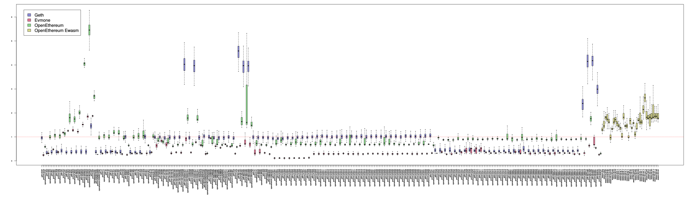

# Gas Cost Estimator - Stage I Report

[Piotr Dobaczewski](https://github.com/pdobacz), [Magdalena Stasiewicz](https://github.com/magdasta)

**Abstract**

We summarize the findings of the first stage of the "Gas Cost Estimator" research project. This research project aims to propose a method of estimating gas costs of EVM/Ewasm OPCODEs (a subset of). In the Stage I Report we give a brief overview of the state of research on the topic, explain the motivation of conducting this research and present some early conclusions from the preliminary exploration. Next, we elaborate on the next steps to perform in the Stage II of this research project. We argue that measuring individual OPCODE execution duration is feasible and gives ample opportunity to analyze the differences in computational cost of different OPCODEs and different EVM/Ewasm implementations.

## Introduction

EVM (Ethereum Virtual Machine) and Ewasm (Ethereum flavored WebAssembly) are instrumental to the functioning of the Ethereum blockchain.
These components are responsible for carrying out the computations associated with transactions on the Ethereum blockchain, namely those related to the functioning of smart contracts.
Due to Turing completeness of their instruction sets, and the necessity to guarantee that computations can be securely performed in an open, distributed network, a halting mechanism must be provided.

The halting mechanism is provided thanks to gas, which is an Ethereum specific measure of computational cost incurred by the executing environment (Ethereum node connected to the network).
Gas is priced in Ether (the intrinsic value token of the Ethereum blockchain), each transaction has an allowance of gas prepaid by the transaction sender.
Every step of computation (as of writing, this corresponds to every bytecode instruction interpreted by EVM/Ewasm) costs a small amount of gas, and if gas allowance is depleted, the computation is halted and its effects are reverted, except for the consumption of the entire gas allowance.
The gas consumed by computations performed is paid out as transaction fee (in Ether) to the miner, or their Eth2.0 counterpart, including the transaction.
The unused remainder of the prepaid gas allowance is returned back to the transaction sender.

The challenge with this mechanism is to determine adequate gas costs of bytecode instructions.
Currently, gas cost is determined on a per-OPCODE basis, that is, every OPCODE interpreted by the EVM/Ewasm has a predetermined gas cost (or its gas cost is expressed as a function of instruction's arguments).
This report and the "Gas Cost Estimator" research project aims at devising a method to estimate adequate values for these OPCODE gas costs, by estimating and analyzing the relative computational cost of OPCODEs.

### Motivation

The importance of adequate gas costs arises from the nature of computations done on the Ethereum blockchain, and has been discussed by many authors.

It is intuitive that the parties participating in the network, who are responsible for validation of blockchain transactions and maintaining the state of the blockchain (miners in Eth1.0), are interested in fair pricing for the service they provide.
This is emphasized in [7].
Given however, that the transaction fee still is the lesser part of the block reward, as compared to PoW mining reward [1], the importance of this argument might be disputed.
It can also be stated, that it is the computational cost of PoW mining itself, which constitutes the major part of computational burden on the miner.

However, adequate gas cost of computation is paramount from the perspective of network security.
Gas cost is a natural deterrent from abusing the network's capacity.
If pricing of computations was inadequate, it would mean that there are operations in EVM/Ewasm which are relatively underpriced, when compared to others.
This would in turn mean that adversarial actors could craft the transactions in a way which puts significant load on the network, at the same time paying disproportionately low transaction fees.
This situation opens the door to DoS attacks, which have happened and were given as main motivation for gas cost revisions in [12], [13], [14] and other research done in [8].

To add to this, there is the decentralization factor of having adequate gas costs.
The computations by EVM/Ewasm components in Ethereum network nodes are performed by all nodes in the network, regardless of whether they are mining and earning transaction fees or not.
In the situation described above, the effect of the DoS attack extends to all participants of the network, most severely impacting less performant systems running on consumer hardware.
The ability of users running nodes on consumer hardware to keep up with the execution of transactions on the blockchain is very important for preserving the decentralized nature of Ethereum.
Such arguments are present in [9].

Another motivation for this work is the indirect effect gas costs of instructions have on smart contract code.
Since the optimization done on smart contract source and intermediate code is usually targeting minimization of gas expenditure of the users of the contract, inadequate gas costs attributed to instructions might lead to skewed optimization results, whereby an optimized smart contract bytecode is not optimal from the point of view of computational cost.

The need to have balanced pricing of EVM/Ewasm computations is brought up in numerous works and discussions like: [10], [11].

Another threat related to inadequate gas costs is mentioned in [15].
Authors argue that such inadequate costs may lead to entire smart contracts becoming imbalanced in terms of their computational costs versus the amount of fees deduced for transacting using these contracts.
This in turn could incentivize parties who include transactions in blocks (miners in Eth1.0) towards preferring certain contracts over others, in order to maximize their returns.
This could lead to a less predictable behavior of the fee market, from the network users' perspective.
Assuming that transactions can in fact be efficiently categorized in terms of which smart contracts they execute on, which is a non-trivial task, one should accept the possibility of such a scenario.

It is interesting to mention that, not entirely related to the motivations of this research but in similar vein, there is also prior work aimed at estimating the computational burden of individual OPCODEs (instructions) of the Java Virtual Machine (CPU), examples are [6], [16], [17], [18].

This report and the entire "Gas Cost Estimator" project are focusing on a subset of EVM/Ewasm OPCODEs.
The OPCODEs in this subset (see [Appendix B: OPCODEs subset](#appendix-b-opcodes-subset) have in common that they do not include any instructions which access the Ethereum storage (e.g. `SSTORE`, `SLOAD` etc.).
On one hand, the focus on only purely computational instructions is intended and desirable, as seen from the point of view whereby the importance of on-chain computations will increase, while the extensive use of Ethereum storage will diminish.
This is driven by the current influx of L2-scalability solutions, which only store the minimum amount of data, putting the burden of providing data on the transaction senders and the burden of validating it on the smart contract [4].
On the other hand, we intend to consider extending the method devised here to storage-bound instructions in the future as well.

### Standardization

One of the factors that contribute to the challenge which gas cost estimation presents is the inherent multitude of environments involved.

By environments in this context we mean:
- different implementations of the Ethereum node (and EVM/Ewasm in consequence), done in different programming languages and with different mindsets
- different hardware on which this software is ran; this is exacerbated by the requirement towards the software to run reliably on both server-grade hardware and consumer-grade desktops alike
- different operating systems

Given the inclusive nature of Ethereum, we are required to examine and include in the analysis the entire spectrum of these environments and determine how much does the environment impact the estimated gas costs. It is desirable, and is intended to be considered in the Stage II of the project, that the method devised here is reasonably easily applicable in those varying environments.
To this end, the approach must be well documented and reproducible by the community.

### Anticipation of Stage II

This report anticipates the completion of Stage II of the project.
Given that, we focus on setting forth a plan and strategy for conducting the future measurements and analysis, rather than providing answers or recommendations for gas cost adjustments straight away.

## Preliminary work and findings of Stage I

None of the quantitative results obtained at Stage I of this research are final nor should be quoted.
There are many caveats and detail work yet to be done, which will impact the final results and conclusions.
As a consequence, we are phrasing our preliminary findings as questions that need to be considered in Stage II.

At Stage I a survey of existing literature and related work was done. We defer writing a full section on this to the Stage II paper.

All work has been carried out in the public GitHub repo [imapp-pl/gas-cost-estimator](https://github.com/imapp-pl/gas-cost-estimator).

### Preliminary method

During the execution of Stage I, preliminary experiments and analysis were performed in order to explore the dynamics of computational effort which OPCODEs of EVM/Ewasm exhibit.
The intention of this exploration was to propose a method for gas cost estimation, which would be further advanced and validated in Stage II.

The method consists of three separate domains:
1. **Program generation** - entails generation of EVM/Ewasm bytecode programs which will be executed in order to gather measurements.
2. **Instrumentation and measurement** - entails the process of running the generated programs in a controlled environment and performing various measurements.
3. **Analysis** - entails the process of statistical analysis and validation of the obtained measurement data.

In the following subsections, the preliminary implementation of these three domains will be briefly described.
Refer to the [section Approach and plan for Stage II](#Approach-and-plan-for-Stage-II) for the planned approach to complete these implementations in Stage II.

#### Preliminary program generation

For Stage I we used the "Simplest valid program" approach.
This set of programs will have one program per OPCODE and it will be a smallest and simplest program which successfully executes the instructions and stops.
Additionally to this, we excluded several OPCODEs, which treatment should be polished out in Stage II (`JUMP`, `JUMPI`, `RETURNDATACOPY`).
We also neglected the entire dimension of arguments supplied to the OPCODEs execution (e.g. `SHA3`), which have substantial impact on the computational cost.

For Ewasm, multiple OPCODEs were excluded at first iteration.
This includes instructions which were either 64-bit, control-flow, memory access, global variable, all requiring more laborious program generation methods.

The source code for preliminary program generation employed can be seen in the [`src/program_generation` dir](https://github.com/imapp-pl/gas-cost-estimator/tree/master/src/program_generator).

#### Preliminary instrumentation and measurement

For Stage I we used the "measure all" approach for individual EVM/Ewasm instructions.
We measured the entire iteration of the interpreter main loop for every instruction in terms of wall clock (nanosecond precision, monotonic) duration.
We took care to provide "fair" measurements for all OPCODEs and all EVM/Ewasm implementations involved, to minimize factors that would be exogenous to the OPCODE execution, and could impact its measurement.
This in particular will require additional polishing out in Stage II, as per [notes left here](https://github.com/imapp-pl/gas-cost-estimator/blob/master/docs/notes/execution_comparison.md), [here](https://github.com/imapp-pl/gas-cost-estimator/blob/master/docs/notes/instrumentation_measurement/evmone.md), [here](https://github.com/imapp-pl/gas-cost-estimator/blob/master/docs/notes/instrumentation_measurement/geth.md) and [here](https://github.com/imapp-pl/gas-cost-estimator/blob/master/docs/notes/instrumentation_measurement/openethereum.md).

Additional to measuring the OPCODE execution time we measure the duration of the capture of time itself.
This is motivated by the fact that (especially for the highly performant EVM/Ewasm implementations) the execution of a single instruction of the interpreter takes a very small amount of time.
To preserve the realistic proportion between the cost of "cheap" and "expensive" OPCODEs, we need to account for the overhead of the time measurement itself.

The instrumentation and measurement were performed for four environments:
1. `geth` - [ethereum/go-ethereum](https://github.com/ethereum/go-ethereum) at [`1.9.12-stable-b6f1c8dc`](https://github.com/ethereum/go-ethereum/releases/tag/v1.9.12).
2. `evmone` - [ethereum/evmone](https://github.com/ethereum/evmone) at [`b1e79b8`](https://github.com/ethereum/evmone/commit/b1e79b870fb20ffcb67ebe3c9b409246dea9f947) with [additional changes implementing the instrumentation](https://github.com/imapp-pl/evmone/commit/2c46241644f07561123f52aa7e69478e0d962010).
3. `openethereum` - [openethereum/openethereum](https://github.com/openethereum/openethereum/) at [`5e3e55b`](https://github.com/openethereum/openethereum/commit/5e3e55bb338c425146c52f75c95912e5385f4790) with [additional changes implementing the instrumentation](https://github.com/imapp-pl/openethereum/commit/ff7835112ab1cbf0834159e5de7811856b36f3d3).
4. `openethereum_ewasm`- [openethereum/openethereum](https://github.com/openethereum/openethereum/) at [`ca3a82f`](https://github.com/openethereum/openethereum/commit/ca3a82f3c417aa6e54b41f888198822ab15c004c) with [additoinal changes implementing the instrumentation](https://github.com/imapp-pl/openethereum/commit/10590bcdb1f9ebdb6663ccacb7038d2464acbbf0).

all running on the same but unspecified hardware (to be rectified in Stage II).

Each measurement was performed in a sequence of N (`sampleSize`) runs within the same OS process and such sequences were repeated M times, each time bringing up a new OS process.

For the environment which has garbage collection (`Go/geth`), the automatic garbage collection was turned off and manually triggered before each program run.

The implementation of the preliminary instrumentation and measurement can be seen in the [`src/instrumentation_measurement` dir](https://github.com/imapp-pl/gas-cost-estimator/tree/master/src/instrumentation_measurement)

#### Preliminary analysis

For Stage I we limited the analysis to graphical representation of the gathered measurements and calculating a few simple statistics, aiming to draw initial conclusions about the feasibility of the instrumentation and measurement approach for Stage I.

Simplifying, the following steps were performed on the measurement data:
1. **Timer overhead adjustment** - offset the duration measurements for OPCODEs by an estimate of the timer overhead, proper to the environment (`geth`, `evmone`, `openethereum`).
2. Draw simple minimums/maximums/means/quantiles etc., boxplots.
3. **Implementation-relative measurements** - express the instruction duration in multiples of mean duration of a selected _pivot OPCODE_, so that we can analyze the relative distribution of computational cost of OPCODEs within each of the environments. This is motivated by the natural fact that implementations vary greatly in overall performance, and differences in cost of OPCODEs would be lost, if treated in absolute terms.
4. Assess the impact of warm-up by plotting out the dynamics of OPCODE durations as a function of the consecutive number of run within the same sample (OS process).
5. Do simple analysis of the dynamics of the timer overhead.

**Figure 1: Implementation-relative measurements of time to compute particular OPCODEs** (click and download for high-quality image). For every OPCODE, the measured wallclock time is plotted using a boxplot. The units of the vertical axis are multiples of the wallclock time of the _pivot OPCODE_, calculated individually for each environment.


The implementation of the preliminary analysis, in form of `R Markdown` notebooks, can be seen in the [`src/analysis` dir](https://github.com/imapp-pl/gas-cost-estimator/tree/master/src/analysis).
An unedited HTML preview of the notebook output can be seen [here for the final analysis](https://htmlpreview.github.io/?https://github.com/imapp-pl/gas-cost-estimator/blob/master/src/analysis/exploration.nb.html) and [here for the timer overhead analysis](https://htmlpreview.github.io/?https://github.com/imapp-pl/gas-cost-estimator/blob/master/src/analysis/exploration_timers.nb.html)

### Preliminary findings

We deliberately defer the presentation of findings in detail until the Stage II, to not jump to conclusions based on results drawn from unfinished tools.

Instead, we will present the questions that will be especially interesting to answer in the continuation of this research.

#### Q1: Can we devise a one-size-fits-all set of OPCODE gas costs?

After visually comparing the implementation-relative measurements (see [section Implementation-relative measurements](#Implementation-relative-measurements)), we suspect that at the current state of EVM/Ewasm implementations, it might be challenging to propose gas costs to OPCODEs, which would apply equally well to all.

E.g., from the preliminary measurement data we saw that, for `evmone` and `openethereum`, several arithmetic OPCODEs (range from `DIV` to `MULMOD`) are consequently more expensive to execute than the pivot OPCODE.
This is however not the case for `geth`.
This means that, given these results are accurate, which is to be further confirmed in Stage II, we might not expect a single good set of gas costs for all the OPCODEs in question, unless there is a parallel effort made to optimize the costly OPCODEs in selected implementations.

#### Q2: Is measuring of individual instructions feasible?

The obtained results led us to the conclusion that measuring individual instructions can be feasible.
However, care must be taken to perform validations of the assumption that the lack of timer precision or its overhead, nor the inclusion of timer function calls itself, don't introduce "unfairness" to the measurements collected.
Refer to the validation techniques planned for Stage II analysis in [section Approach and plan for Stage II](#Approach-and-plan-for-Stage-II) for ideas on tackling this.
There, we will also list possible fallback plans in case there is evidence that the noise and overhead present in this method of measurement is unacceptable.

#### Q3: How can we explore the entire program space to capture all sources of variability of OPCODEs computational cost

The main intention of the research presented here is to obtain a relative comparison of costs of OPCODEs, accounting for the sources of variability that are already represented by the current gas cost schedule.
An example of such variability is that the gas cost of a `SHA3` OPCODE is a function of the size of its arguments, `g = 30 + 6*x`, where `x` is the count of words (rounded up) for input data to the `SHA3` operation [2].
Size of this OPCODE's arguments naturally impact its computational cost.

It is tempting to search for sources of variability unaccounted for in the current gas schedule.
A hypothetical example of such a situation would be one, where, for example, `PUSH1` operation became more expensive, after having been repeated multiple times in the program.

#### Q4: How should warm-up be treated?

Preliminary results indicate that first OPCODEs to execute in the program, as well as first OPCODEs to execute in the context of an OS process, have a noticeable penalty in terms of execution duration.
This is a natural phenomenon usually referred to as warm-up in program benchmarking, and the usual treatment is discarding the first batch of measurement samples.

We need to answer, what is the appropriate amount of warm-up executions which we want to discard, for the measurements to remain "fair" from the point of view of our goals.
A limiting factor here is that the timer code to collect duration measurements itself seems to exhibit a warm-up phase.

In any case, the treatment of warm-up will be such that measurements mimic normal operation of the EVM/Ewasm modules within Ethereum nodes.

#### Q4a: How should cache and locality be treated?

We suspect that using the simplest program generation routine, we might not model the cache behavior and locality adequately.
Real-life smart contract EVM programs seldom execute only a single instruction or a single instruction repeatedly.

It must be assessed and estimated, how do cache and locality impact the computations.
We will analyze adjustments to the program generator, where the generated programs will represent typical smart contract execution circumstances.
Alternatively, we will explore the space of generated programs so that programs enacting different behavior of cache and data locality are included.

#### Q5: How to fairly treat EVM/Ewasm implementations with JIT capabilities?

`evmone` optimizes its operation by performing a preprocessing step and offloading some computations to be done per code block, rather than per instruction.
As long as it is still functioning as an interpreter, and every instruction is executed separately, this isn't an obstacle.
It may only require the measuring of a single OPCODE in various circumstances, allowing us to observe the variability of the OPCODEs cost (see Q3).

#### Q6: How to standardize the gas cost estimation procedure?

As noted earlier, we envision that an added feature of the research could be a standard procedure to estimate gas costs in other environments.
Similar attempts have been made in [7].

See [section Approach and plan for Stage II](#Approach-and-plan-for-Stage-II) for the plan how to facilitate standardization.

## Approach and plan for Stage II

We will proceed with the research in Stage II in a highly iterative fashion.
If the findings gathered invalidate the assumptions, the approach and plan will be adjusted.

### Goal of Stage II

Propose a method of giving an accurate proposition of the EVM/Ewasm gas costs for every one of the subset of EVM OPCODEs, as well as define what "accurate" means and how to assess it.

The method should be feasible for various implementations/hardware etc. and have "good properties".
Ideally, the method could become a standard (framework) for profiling EVM/Ewasm implementations in terms of OPCODE gas costs.

Accurate and with good properties, in the context of an estimate of OPCODE gas cost, means:
- It is proportional to the OPCODE's computational cost, or otherwise balanced when compared to other OPCODEs.
- It is modeled to explain the variation in computational cost coming from different circumstances and/or parameters.
- It is adequate for all implementations and environments, if that's possible.
- It can be clearly stated, when no such value exists because of differences in implementations.
- It should have the measurement overhead and noise under control and "fair" for all OPCODEs.

### Program generation

In this section we describe the approach to sample EVM/Ewasm program generation.

Programs will be generated directly as bytecode to be supplied to the EVM/Ewasm for execution.

#### Properties of program generation

When generating our programs we want to ensure the following:
1. **Uniform coverage** - we want programs to cover the space of OPCODEs completely, so that all the OPCODEs are modeled appropriately and "fairly":
    - Impact of values on stack is captured.
    - Impact of circumstances where the instructions appear is captured.
2. **Little measurement noise** - we want programs to be such that noise is limited:
    - In particular we want to be able to tell, if factors external to the OPCODE execution impact the measurement.
    - I.e. we want to separate "good variance" from "bad variance." The former means variance that represents variability in computational cost inherent to the OPCODE execution. The latter means noise introduced by inadequate measurement and external factors.
3. **Feasibility of measurement** - we want programs to be easily supplied to various EVM/Ewasm implementations and measurement harnesses we devise.

At Stage II, we plan to compile a detailed rundown of the specifics of each OPCODE, to be taken into account when using in program generation and then instrumentation, since some OPCODEs have special traits which should be kept in mind (e.g. `CALLDATASIZE` reads from the calldata input to EVM/Ewasm execution, `BALANCE` might depend on the balance of the account checked).

The final approach to generate programs will be devised in an iterative manner, so as to arrive at the simplest solution which gives good results.

To start the design iterations, we have the following possible alternatives:

#### Simplest valid program

**NOTE** This has already been implemented in Stage I, pending some minor fixes.

This set of programs will have one program per OPCODE and it will be a smallest and simplest program which successfully executes the instructions and stops.

#### Simplest valid program with customizable stack/arguments

This is an extension of the "Simplest valid program" approach, where we'll allow to generate programs which execute their OPCODEs with different arguments, so that we can enact their behavior to cover the scope of variability that the current gas schedule allows for (e.g. various sizes of the input for the `SHA3` OPCODE).

#### Simplest valid program with surrounding bytecode prepended/appended

Before a full-fledged support for exploring various circumstances and their impact on the execution of a given OPCODE, we can provide a simplified probe of the topic.

In this approach, we will generate programs same as in "Simplest valid program" approach, but:
- prepend and/or append a sequence of fixed arbitrary bytecodes, to put the analyzed OPCODE in the "middle" of the program, and/or
- multiply the OPCODE with its stack management companions

Such programs can then be used for initial exploration of the impact of bytecode surrounding the OPCODE in question.

#### Looped execution with stack balancing

See [3].

This approach will be very useful to validate the individual instruction measurements with whole-program measurements.

#### Completely randomized with stack balancing

This is an extension of the "Simplest valid program" approach, where we'll generate random programs, mixing instructions of all OPCODEs from the subset, that only are known to execute successfully due to correct stack balancing.

This approach will be very useful to validate the individual instruction measurements with whole-program measurements ("measure total").
Also it will be applicable as the first step towards exploring the sources of variability of OPCODE cost driven by various circumstances in which these OPCODEs are executed.

#### Automated, adaptive generation

This is somewhat similar to the approach from [4], which describes a genetic algorithm minimizing the gas throughput (gas/second).
Pursuing this possibility is an optional expansion to the scope of the research, which will be considered at Stage II.

We could modify this idea to run a genetic algorithm (or any other adaptive method with an objective function) maximizing our desired properties, i.e.:
- Maximize variance (information) captured in the measurement of a particular OPCODE, in particular circumstances (particular `program`, particular location).
- Minimize variance (noise) coming from different environments.
- Maximize uniformity.

This could also be useful to discover the impact of circumstances, where a particular OPCODE can exhibit much different computational burden, depending on where it is located in the program.

One challenge is how to model OPCODEs with variable size of parameters (e.g. `SHA3`): they would have unbounded values and also unbounded variance, if not modeled correctly.
We could model as `t = c + a*x`, `c` constant, `x` size, `a` coefficient to model.
Then, instead of most variance/information about `t`, we want most information on `c` and `a`.

### Instrumentation and measurement

In this section we describe the approach to instrumentation and measurement of sample program execution.

We will execute an EVM/Ewasm program, with one chosen form of instrumentation and measurement enabled:

1. **Trace OPCODEs and arguments** - produces a list of OPCODEs for all instructions executed in a program, along with their relevant arguments (stack, memory). This will be used to know what were the instructions executed during a single run of a program.
2. **Measure all** - (individual instruction measurement) produces a list of measurements per instruction, in order of execution, _for all instructions in the program_.
3. **Measure one** - (individual instruction measurement, optional) produce a single measurement for a chosen instruction, i.e. "measure Nth instruction from start of the program".
4. **Measure total** - (whole-program measurement) produce a single overarching measurement for the entire program execution.
4. **Measure batch** - (hybrid measurement, optional) produce a single measurement for a sequence of same OPCODEs, according to metadata passed to the instrumentation code (e.g. `{measure_from_instruction: 123, measure_to_instruction: 234}` will measure 111 adjacent instructions as if they were one).

When we speak of measurements, we will be measuring the wall clock time.
Measurements of CPU cycles using TSC (`RDTSC`, `gotsc` etc.) might be used for validation and comparison.

#### Measurement "fairness" and coverage

As already started in Stage I effort, we will further polish out the "fairness" of measurements for all OPCODEs and all EVM/Ewasm implementations involved, to minimize factors that would be exogenous to the OPCODE execution, and could impact its measurement.

In particular, but not limited to, we will take care that in each environment and for each OPCODE, the scope of measured execution is as similar as possible, so that the results are comparable.

We will also make sure, and elaborate on, to represent as closely as possible the scope of execution to that which is proper to the EVM/Ewasm functioning within an operating Ethereum node.

A particular facet of this is the approach to garbage collection.
We can continue to turn the garbage collector off and trigger manually outside of measured scope, as we did in Stage I, in case it is established, that this approach is "fair" for all OPCODEs, that is we miss out the impact of OPCODEs on garbage collection and impact of garbage collection on OPCODE computations evenly.
Alternatively we can leave the garbage collection on by default and factor its impact into our analysis.

#### Individual measurement vs entire program execution measurement

The main question regarding the measurement of (CPU-bound) computational cost of instructions is, whether it is the individual instruction execution to be measured or an entire program execution, consisting of multiple instructions.

In the former, we measure each iteration of the inner loop of the EVM/Ewasm interpreter.
[See Stage I preliminary results](https://htmlpreview.github.io/?https://github.com/imapp-pl/gas-cost-estimator/blob/master/src/analysis/exploration.nb.html) for an example application of this approach.

**Pros**

- Measurement is more granular and allows us to analyze the measurements without worrying about statistical errors.
- In particular, it allows for granular discrimination between cost of OPCODEs located in various circumstances.

**Cons**

- Need to be careful about timer precision and overhead (preliminary results try to account for it).

In the latter approach we measure the entire execution of the EVM/Ewasm interpreter loop, [see for example here](https://notes.ethereum.org/@chfast/benchmarking-evm-instructions).

**Pros**

- Impact of timer precision and overhead on the measurements is much less problematic.
- Program execution resembles production operation more, there are no instrumentation calls within the interpreter loop.

**Cons**

- Couples the intrinsic effect of instruction circumstances with their statistical impact on the estimator outcome.
- Must be more careful about program generation, to not have a dataset with adverse statistical properties (e.g. we'd need a very homogenous set of generated programs, which is hard given the need to balance the stack).
- The need to do stack balancing, which consists in injecting `PUSH...` (`DUP...`) and `POP` instructions will interfere with the estimator values, following a GitHub thread [5].

**Plan for Stage II:** Use individual instructions as the estimator and the entire program measurement as validation.
Our goal metric can be, how closely does the estimate coming from individual measurements can model the cost of an entire program.

In case individual measurements method is deemed unacceptable, following fallback plans are possible:
- For very cheap OPCODEs, substitute individual instruction occurrences (e.g. `ISZERO`) with sequences of many instructions with pre-balanced stack (e.g. `DUP1 x 99, ISZERO x 100`) and use the "measure batch" instrumentation.
- Use a binomial or similar model to extract the duration of an event shorter than the timer resolution [6].
- Use CPU cycles as a proxy of computational cost, instead of wallclock duration.

#### Timer overhead adjustment

The reading of a timer has itself an overhead. In a sequence of steps:

```
t0 = timer.now()
measured_code...
t1 = timer.now()
```

what is really measured is both the `measured_code` and `timer.now()`, latter being the overhead of the timer.
Since in our case for **individual instructions** measurements, `measured_code` sometimes executes within a few nanoseconds, it is necessary to take extra care to ensure that the timer overhead is as small as possible, and to account for it in the analysis step.

We do that within our [preliminary results](https://htmlpreview.github.io/?https://github.com/imapp-pl/gas-cost-estimator/blob/master/src/analysis/exploration.nb.html) by subtracting an estimate of the overhead for all environments (`Go/geth`, `C/evmone`, `Rust/OpenEthereum`).

The [estimation of timer overhead is done in these preliminary results](https://htmlpreview.github.io/?https://github.com/imapp-pl/gas-cost-estimator/blob/master/src/analysis/exploration_timers.nb.html).
As the timer overhead estimate we use the minimum observed duration between two `timer.now()`s, one immediately after the other.

Moving forward, we are planning to continue adjusting for the timer overhead, with the following improvements:
- We'll monitor and register the timer overhead during the OPCODE measurements. This is motivated by the observation from the preliminary results, that the timer overhead measured exhibits periodic bumps. We will consider filtering out the measurements where the measure timer overhead was above a given threshold.
- We should also separately conduct a statistical test that for every OPCODE, a measurement of the timer overhead is significantly smaller than the timer overhead, or prepare a similar argument see [section Estimation validation and exploration](#Estimation-validation-and-exploration).

#### Repetition and accounting for warm-up

We will repeat the execution a number of times, within the same instance of the EVM/Ewasm environment (e.g. OS process etc.).
Every such repetition will be called a **run**.

Measurements for initial runs have been detected to be larger, and they might either be discarded or kept.

It will be explored, whether normal node operation exhibits such "initial conditions" regularly or not.
Regardless, all OPCODEs should receive fair treatment in this aspect.

### Analysis

In this section we outline the approach to analyzing the obtained measurement data.
Questions that the analysis stage should strive to answer:
1. Is the choice of sample programs adequate?
2. Is the method of measurement adequate?
3. What is the gas cost estimation for every OPCODE analyzed?
4. What is the quality of the particular gas cost estimation?
5. What are the differences in gas cost estimates for various implementations, and how these might be addressed?

#### Implementation-relative measurements

When comparing measurements coming from different implementations (or hardware environments) it is useful to compare using measurements expressed in multiples of mean duration of a selected "pivot OPCODE" (or mean across all OPCODEs, but this is probably less reliable). See [preliminary analysis here](https://htmlpreview.github.io/?https://github.com/imapp-pl/gas-cost-estimator/blob/master/src/analysis/exploration.nb.html) for the values obtained in this fashion.
For the preliminary analysis, the OPCODE `COINBASE` was chosen arbitrarily, this choice will be revisited.

We'll use implementation-relative measurements whenever we want to compare the relative proportions of OPCODE measurements between environments (mainly different implementations).

#### Estimation validation and exploration

Here we outline the choice of options for validations to do on the obtained measurements:
1. **Compare OPCODE measurement statistics between themselves and between different implementations** - inspect the means/quantiles/variances/distributions and look for abnormalities, list out and attempt to explain them.
1. **Compare individual instruction vs entire program execution** - see how well does the former predict the latter (see [Individual measurement vs entire program execution measurement](#Individual-measurement-vs-entire-program-execution-measurement)).
2. **Analyze individual OPCODEs dynamics** - generate a multitude of programs whereby the OPCODE is run in varying circumstances. See if the measurement error is random and we're accounting for all the dynamics of computational cost of the OPCODE.
3. **Cross-environment OPCODE validation** - check OPCODEs which have drastically different relative estimates in different implementations/hardwares, look into whether the reason is intrinsic to the implementation/hardware or is due to error.
4. **Impact on gas cost schedule** - estimate the gas costs, calibrate to the excluded OPCODEs and compare with current gas schedule. Repeat for estimates from various environments and methods. Analyze the impact of gas cost adjustments.
3. **Historical validation** - check against blockchain history under normal conditions where the node is run (see [Instrumenting and measuring the computations from blockchain history](#Instrumenting-and-measuring-the-computations-from-blockchain-history)).
4. **Cross-timer validation** - capture all results using an alternative CPU cost proxy (e.g. instead of `runtimeNano` use `gotsc` CPU cycles), see how they compare.

#### Instrumenting and measuring the computations from blockchain history

For an additional validation of the gas cost estimates, we consider instrumenting and measuring a fragment of the blockchain.

A problem arises from the fact that our gas cost estimator is prepared only for a subset of instructions (in particular, no IO/storage instructions), so we don't estimate for IO/storage instructions at all.
If we want to validate using the execution of contracts historical transactions, this involves IO/storage.
We need a way to relate our gas cost estimates (for a subset of OPCODEs), with the rest.

We will consider calibrating these together by picking a "pivot OPCODE", whose gas cost would remain unchanged, and adjusting gas cost for all other OPCODE from the analyzed subset to match the relative difference in cost to the pivot OPCODE.
For example, if we pick `COINBASE` as pivot, all other OPCODEs costs from our subset are expressed as multiples of `COINBASE`'s cost.
Since currently `COINBASE` costs 2 gas, we derive new gas cost values for our subset of OPCODEs.
The remainder of OPCODEs (IO/storage etc.) remains unadjusted.

Next we could:
1. calculate the gas cost for a sequence of real blocks, using such adjusted gas costs
2. capture a coarse measurement of resources consumed to validate those blocks (e.g. time per block, time per transaction)
3. assess how well does the adjusted gas schedule model the consumed resources

### Standardization

The standardization effort will be done in the three domains:
- **Program generation** - this being the simplest one, as it doesn't directly depend on the environment. The requirement is here that program generation is well documented and easily pluggable into the rest of the stack. To this end standard program generating scripts will be devised, along with standard input/output data formats,
- **Instrumentation and measurement** - here data standards for output/input will be proposed as well. On the other hand a ruleset for each of the measurement methods will be designed, where the standard instruction measurement guidelines will be given,
- **Analysis** - a suite of scripts to visualize and validate the measurement data will be given. Due to the exploratory nature of this domain, this is treated as more optional. Ideally, a script which takes program and measurement data as input and presents all the plots and statistics used to validate the process as output, could be designed.

## Appendix A: detailed task list

Here we collect a tentative list of various tasks and todos to complete in Stage II, which were identified during the completion of Stage I.
This list _is not_ an exhaustive work breakdown structure for Stage II.
Some of these tasks might be deemed unnecessary or optional (denoted "(opt)") during the execution of Stage II.

Refer to the other sections for details on the tasks.

1. Program generation tasks
    1. Compile a detailed rundown of the specifics of each OPCODE
    2. Allow to customize stack/arguments
    4. Generate programs with surrounding bytecode prepended/appended
    4. Generate programs so that they can enact different behavior of cache and data locality
    3. Generate programs with looped execution with stack balancing
    4. (opt) Generate random programs with stack balancing
    5. (opt) Generate programs via automated, adaptive generation
    6. Redesign input/output data structures, document and standardize
    7. Make program generation easily pluggable into the rest of the stack, standardize and document
    8. Design and complete program generation for other included Ewasm OPCODEs
2. Instrumentation and measurement tasks
    1. Allow to trace OPCODEs and arguments via instrumentation
    3. Improve, make "fair" and ensure full coverage of execution for the "measure all" instrumentation
    2. (opt) Allow to do "measure one" instrumentation for instruction by index
    4. Allow to do "measure total" instrumentation fairly and with full coverage of execution
    5. (opt) Allow to do "measure batch" instrumentation
    5. (opt) Possibly adjust the instrumentation to doing the modelling of duration via the binomial model
    6. (opt) Try and compare alternative wallclock timers (e.g. PAPI)
    7. (opt) Provide full support for CPU cycles using TSC libraries
    8. Write down the instrumentation and measurement standard ruleset
    9. (opt) Try further lowering the overhead of wallclock timers
    10. Provide consistent treatment of warm-up
    11. Analyze warm-up conditions versus normal EVM/Ewasm operation within an Ethereum node
    12. Support gathering of timer overhead measurements during OPCODE measurements
    13. Support for instrumentation in at least one another Ewasm implementation
    14. Rethink the approach to garbage collection for environments that have one
3. Analysis tasks
    1. Tidy and improve structure of the existing analysis code in R, allow for its extensibility
    1. Improve the visualization method to check distributions of measurements per OPCODE and environment (frequency plots used in Stage I are not useful)
    1. Look into the extreme outliers in OPCODE measurements, if they are still present after rectifying the instrumentation stack
    1. Revisit the choice of the pivot OPCODE for implementation-relative measurements, describe criteria for this choice
    1. Allow analysis of OPCODE measurements coming from programs in which their execution has been parameterized (via arguments, circumstances)
    2. Explore validation methods proposed
    3. Implement automated scripts for the chosen validation methods
    4. (opt) Implement (or adapt an existing implementation or existing data sets, if they exist) validation via blockchain history
    5. Give recommendations for any gas cost adjustments which could be safely done at current stage (i.e. ones which are reasonable consistently between all environments measured)
    6. Identify OPCODEs which will not have a gas cost suitable for all environments and try to find the cause and recommend optimizations
    6. Answer "Q1: Can we devise a one-size-fits-all set of OPCODE gas costs?"
    7. Provide a quantitative argument (e.g. a statistical test) that for every OPCODE, measurement of the timer overhead is significantly smaller
    7. Answer "Q2: is measuring individual instructions feasible?"
    8. (opt) Devise scoring functions which can be used to adaptively generate programs
    8. (opt) Provide a performant implementations of the scoring functions which can be reasonably plugged into an search algorithm for adaptive program generation
    8. (opt) Answer "Q3: How can we explore the entire program space to capture all sources of variability of OPCODEs computational cost"
    9. Discuss instrumentation warm-up vs actual contract startup overhead
    9. Answer "Q4: How should warm-up be treated?"
    10. Analyze impact of programs with various behavior of cache and data locality
    10. Answer "Q4a: How should cache and locality be treated?"
    10. (opt) Answer "Q5: How to fairly treat EVM/Ewasm implementations with JIT capabilities?"
    11. (opt) Answer "Q6: How to standardize the gas cost estimation procedure?"
4. Hardware and environment diversity tasks
    1. Provision and run measurements on a machine in the cloud
    2. Provision and run measurements on representative consumer-grade machines of various kinds
5. Standardization tasks
    1. Ensure easy application of the automated scripts for validation methods, document
6. Documentation tasks
    1. Write full section on Related Work, from sources gathered in Stage I and Stage II

## Appendix B: OPCODEs subset

Refer to [`src/program_generator/data`](https://github.com/imapp-pl/gas-cost-estimator/tree/master/src/program_generator/data) for detailed notes on OPCODEs rejected in the program generation phase.
Refer to the [`exploration notebook`](https://htmlpreview.github.io/?https://github.com/imapp-pl/gas-cost-estimator/blob/master/src/analysis/exploration.nb.html) for notes on OPCODEs rejected in the analysis phase.

### EVM OPCODEs

```
0x00 STOP
0x01 ADD
0x02 MUL
0x03 SUB
0x04 DIV
0x05 SDIV
0x06 MOD
0x07 SMOD
0x08 ADDMOD
0x09 MULMOD
0x0a EXP
0x0b SIGNEXTEND
0x10 LT
0x11 GT
0x12 SLT
0x13 SGT
0x14 EQ
0x15 ISZERO
0x16 AND
0x17 OR
0x18 XOR
0x19 NOT
0x1a BYTE
0x30 ADDRESS
0x32 ORIGIN
0x33 CALLER
0x34 CALLVALUE
0x35 CALLDATALOAD
0x36 CALLDATASIZE
0x37 CALLDATACOPY
0x38 CODESIZE
0x39 CODECOPY
0x3a GASPRICE
0x3d RETURNDATASIZE
0x3e RETURNDATACOPY
0x41 COINBASE
0x42 TIMESTAMP
0x43 NUMBER
0x44 DIFFICULTY
0x45 GASLIMIT
0x50 POP
0x51 MLOAD
0x52 MSTORE
0x53 MSTORE8
0x56 JUMP
0x57 JUMPI
0x58 PC
0x59 MSIZE
0x5a GAS
0x5b JUMPDEST
0x60 PUSH1
0x61 PUSH2
0x62 PUSH3
0x63 PUSH4
0x64 PUSH5
0x65 PUSH6
0x66 PUSH7
0x67 PUSH8
0x68 PUSH9
0x69 PUSH10
0x6a PUSH11
0x6b PUSH12
0x6c PUSH13
0x6d PUSH14
0x6e PUSH15
0x6f PUSH16
0x70 PUSH17
0x71 PUSH18
0x72 PUSH19
0x73 PUSH20
0x74 PUSH21
0x75 PUSH22
0x76 PUSH23
0x77 PUSH24
0x78 PUSH25
0x79 PUSH26
0x7a PUSH27
0x7b PUSH28
0x7c PUSH29
0x7d PUSH30
0x7e PUSH31
0x7f PUSH32
0x80 DUP1
0x81 DUP2
0x82 DUP3
0x83 DUP4
0x84 DUP5
0x85 DUP6
0x86 DUP7
0x87 DUP8
0x88 DUP9
0x89 DUP10
0x8a DUP11
0x8b DUP12
0x8c DUP13
0x8d DUP14
0x8e DUP15
0x8f DUP16
0x90 SWAP1
0x91 SWAP2
0x92 SWAP3
0x93 SWAP4
0x94 SWAP5
0x95 SWAP6
0x96 SWAP7
0x97 SWAP8
0x98 SWAP9
0x99 SWAP10
0x9a SWAP11
0x9b SWAP12
0x9c SWAP13
0x9d SWAP14
0x9e SWAP15
0x9f SWAP16
0xf3 RETURN
0xfd REVERT
0xfe INVALID
```

### Ewasm OPCODES

```
0x00 unreachable
0x01 nop
0x02 block
0x03 loop
0x04 if
0x05 else
0x0B end
0x0C br
0x0D br_if
0x0E br_table
0x0F return
0x10 call
0x11 call_indirect
0x1A drop
0x1B select
0x20 local.get
0x21 local.set
0x22 local.tee
0x23 global.get
0x24 global.set
0x28 i32.load
0x29 i64.load
0x2C i32.load8_s
0x2D i32.load8_u
0x2E i32.load16_s
0x2F i32.load16_u
0x30 i64.load8_s
0x31 i64.load8_u
0x32 i64.load16_s
0x33 i64.load16_u
0x34 i64.load32_s
0x35 i64.load32_u
0x36 i32.store
0x37 i64.store
0x3A i32.store8
0x3B i32.store16
0x3C i64.store8
0x3D 64.store16
0x3E i64.store32
0x3F memory.size
0x40 memory.grow
0x41 i32.const
0x42 i64.const
0x45 i32.eqz
0x46 i32.eq
0x47 i32.ne
0x48 i32.lt_s
0x49 i32.lt_u
0x4A i32.gt_s
0x4B i32.gt_u
0x4C i32.le_s
0x4D i32.le_u
0x4E i32.ge_s
0x4F i32.ge_u
0x50 i64.eqz
0x51 i64.eq
0x52 i64.ne
0x53 i64.lt_s
0x54 i64.lt_u
0x55 i64.gt_s
0x56 i64.gt_u
0x57 i64.le_s
0x58 i64.le_u
0x59 i64.ge_s
0x5A i64.ge_u
0x67 i32.clz
0x68 i32.ctz
0x69 i32.popcnt
0x6A i32.add
0x6B i32.sub
0x6C i32.mul
0x6D i32.div_s
0x6E i32.div_u
0x6F i32.rem_s
0x70 i32.rem_u
0x71 i32.and
0x72 i32.or
0x73 i32.xor
0x74 i32.shl
0x75 i32.shr_s
0x76 i32.shr_u
0x77 i32.rotl
0x78 i32.rotr
0x79 i64.clz
0x7A i64.ctz
0x7B i64.popcnt
0x7C i64.add
0x7D i64.sub
0x7E i64.mul
0x7F i64.div_s
0x80 i64.div_u
0x81 i64.rem_s
0x82 i64.rem_u
0x83 i64.and
0x84 i64.or
0x85 i64.xor
0x86 i64.shl
0x87 i64.shr_s
0x88 i64.shr_u
0x89 i64.rotl
0x8A i64.rotr
0xA7 i32.wrap_i64
0xAC i64.extend_i32_s
0xAD i64.extend_i32_u
0xC0 i32.extend8_s
0xC1 i32.extend16_s
0xC2 i64.extend8_s
0xC3 i64.extend16_s
0xC4 i64.extend32_s
```

## Acknowledgements

[Paweł Bylica](https://github.com/chfast), [Marcin Benke](https://github.com/mbenke), [Radosław Zagórowicz](https://github.com/rodiazet), [Piotr Janiuk](https://github.com/viggith) for invaluable help and contributions throughout the entire project.

## References

[1] [https://etherscan.io/block/11660498](https://etherscan.io/block/11660498)

[2] [ETHEREUM: A SECURE DECENTRALISED GENERALISED TRANSACTION LEDGER PETERSBURG VERSION 6424f7d – 2020-12-28DR. GAVIN WOODFOUNDER, ETHEREUM & PARITYGAVIN@PARITY.IO](https://ethereum.github.io/yellowpaper/paper.pdf)

[3] [Benchmarking EVM Instructions. Paweł Bylica @chfast](https://notes.ethereum.org/@chfast/benchmarking-evm-instructions)

[4] Perez, Daniel & Livshits, Benjamin. (2020). Broken Metre: Attacking Resource Metering in EVM. 10.14722/ndss.2020.24267.

[5] [https://github.com/imapp-pl/gas-cost-estimator/pull/19#discussion_r554907184](https://github.com/imapp-pl/gas-cost-estimator/pull/19#discussion_r554907184)

[6] Lambert, Jonathan & Power, James. (2008). Platform Independent Timing of Java Virtual Machine Bytecode Instructions. Electr. Notes Theor. Comput. Sci.. 220. 97-113. 10.1016/j.entcs.2008.11.021.

[7] Aldweesh, Amjad & Alharby, Maher & Mehrnezhad, Maryam & van Moorsel, Aad. (2019). OpBench: A CPU Performance Benchmark for Ethereum Smart Contract Operation Code. 10.1109/Blockchain.2019.00043.

[8] Chen, Ting & Li, Xiaoqi & Wang, Ying & Chen, Jiachi & Li, Zihao & Luo, Xiapu & Au, Man Ho & Zhang, Xiaosong. (2017). An Adaptive Gas Cost Mechanism for Ethereum to Defend Against Under-Priced DoS Attacks. 10.1007/978-3-319-72359-4_1.

[9] Yang, Renlord & Murray, Toby & Rimba, Paul & Parampalli, Udaya. (2019). Empirically Analyzing Ethereum's Gas Mechanism.

[10] [https://gist.github.com/holiman/7153e088af8941379cf21c0e4610d51f](https://gist.github.com/holiman/7153e088af8941379cf21c0e4610d51f)

[11] [https://github.com/ethereum/go-ethereum/pull/21207](https://github.com/ethereum/go-ethereum/pull/21207)

[12] [EIP-150](https://eips.ethereum.org/EIPS/eip-150)

[13] [EIP-1884](https://eips.ethereum.org/EIPS/eip-1884)

[14] [EIP-2046](https://eips.ethereum.org/EIPS/eip-2046)

[15] Aldweesh, Amjad & Alharby, Maher & Solaiman, Ellis & van Moorsel, Aad. (2018). Performance Benchmarking of Smart Contracts to Assess Miner Incentives in Ethereum. 144-149. 10.1109/EDCC.2018.00034.

[16] Wong, P. (2010). Bytecode Monitoring of Java Programs.

[17] Camesi, Andrea & Hulaas, Jarle & Binder, Walter. (2006). Continuous Bytecode Instruction Counting for CPU Consumption Estimation. Third International Conference on the Quantitative Evaluation of Systems, QEST 2006. 10.1109/QEST.2006.12.

[18] Bernard L. Peuto and Leonard J. Shustek. 1977. An instruction timing model of CPU performance. SIGARCH Comput. Archit. News 5, 7 (March 1977), 165–178. DOI:https://doi.org/10.1145/633615.810667
